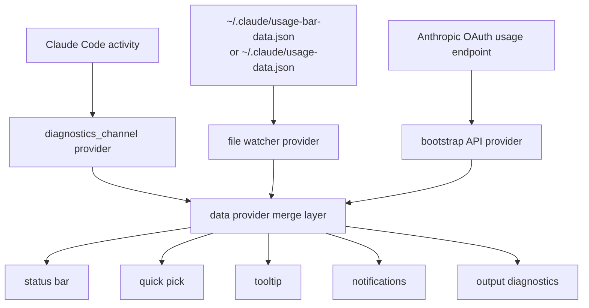

# Claude Usage

[](https://open-vsx.org/extension/imamirezaei/claude-usage)
[](https://marketplace.visualstudio.com/items?itemName=imamirezaei.claude-code-usage-vsx)
[](https://open-vsx.org/extension/imamirezaei/claude-usage)
[](https://marketplace.visualstudio.com/items?itemName=imamirezaei.claude-code-usage-vsx)

Real-time Claude Code usage monitoring in the status bar.

It shows:
- Session usage (5h window)
- Weekly usage (7d window)
- Reset countdowns
- Quick actions for refresh, settings, and diagnostics

## Install

- Open VSX: [Claude Usage](https://open-vsx.org/extension/imamirezaei/claude-usage)
- VS Code Marketplace: [Claude Code Usage Monitoring](https://marketplace.visualstudio.com/items?itemName=imamirezaei.claude-code-usage-vsx)

## How It Works

The extension merges data from three sources, in priority order:

1. `diagnostics_channel`
2. Local file fallback
3. OAuth usage bootstrap + polling

If a higher-priority source has fresh data, it wins.



## Commands

- `Claude Usage: Show Details`
- `Claude Usage: Refresh Rate Limit`
- `Claude Usage: Switch Display Mode (Session / Weekly / Both)`
- `Claude Usage: Open Output`

## Settings

- `claudeUsage.displayMode`
- `claudeUsage.warningThreshold`
- `claudeUsage.criticalThreshold`
- `claudeUsage.refreshInterval`
- `claudeUsage.showCountdown`
- `claudeUsage.notificationsEnabled`

## Local Fallback

If you want a zero-extra-call path, configure Claude Code to write a usage JSON file. The extension watches:

- `~/.claude/usage-bar-data.json`
- `~/.claude/usage-data.json`

## Packaging

This repo ships separate release artifacts for the two marketplaces:

- Open VSX output: `releases/open-vsx/`
- VS Code Marketplace output: `releases/vscode/`

Build both:

```bash
npm run package:all
```

Build one target:

```bash
npm run package:openvsx
npm run package:vscode
```

## Privacy

The extension reads Claude Code responses and local files. It does not send usage data to third-party services. When OAuth bootstrap is enabled, the request goes directly to Anthropic.

## License

MIT
